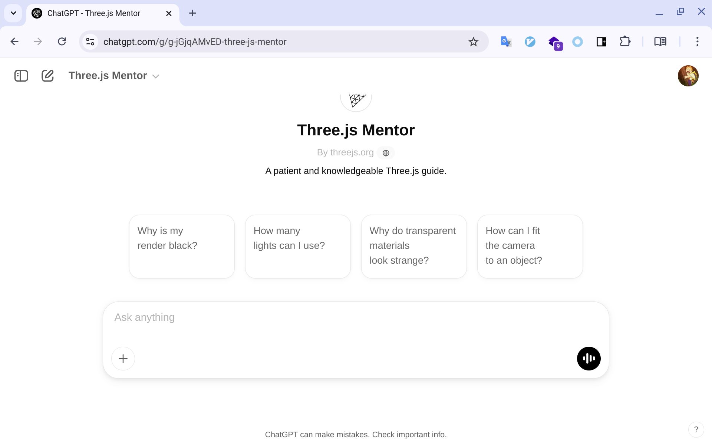
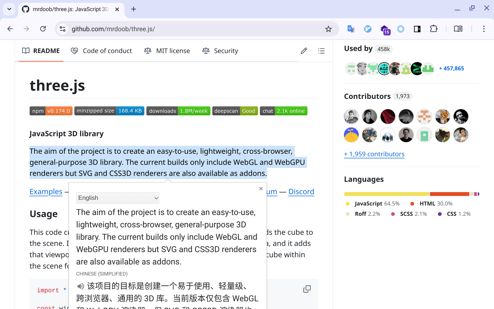

# 小方 Three.js 2025 极简入门: 1. Hello Three.js


## Three.js 简介

没有简介，是的，我特地上官网看了，首页并没有一个传统的使用文字来表述的落地页。

例如像:
Vue的落地页是`The Progressive JavaScript Framework`；
React的落地页是`The library for web and native user interfaces`；
Vite的落地页是`The Build Tool for the Web`。


惊不惊喜，意不意外。


那么 Three.js 是如何介绍自己的泥？

相应地，在官网首页的右侧有一块用于展示使用 Three.js 开发的项目列表。


也就是说，Three.js 可能觉得用文字来介绍自己太过于苍白，于是选择了直接秀肌肉。

它不直接说自己是干啥的，那我也不说。

那让 AI 说一说？怎么证明这篇教程是最近写的呢。

官网的左侧目录那里有一个 GPT 的链接，打开是这样色的：




GPT 机器人？Agent？这里：https://chatgpt.com/g/g-jGjqAMvED-three-js-mentor


Three.js 虽然没在官网介绍自己，但无所谓，没有不透方的墙。我在 GitHub 上找到了文字介绍。




```md
JavaScript 3D library

The aim of the project is to create an easy-to-use, lightweight, cross-browser, general-purpose 3D library. The current builds only include WebGL and WebGPU renderers but SVG and CSS3D renderers are also available as addons.

```

核心要点如下：
- 我是 JavaScript 工具包
- 我是干 3D 的，3D 是谁？
- 我浑身是宝：easy-to-use, lightweight, cross-browser, general-purpose
- 我成品只有 WebGL and WebGPU renderers，但你如果需要 SVG and CSS3D renderers 也可以整上，得加钱


它是干啥的是整明白了，但又引出了另一个概念--WebGL。


## WebGL 简介

我们来顺藤摸瓜，来看下 WebGL 是个什么玩意。


既然是 Web 上的相关技术，那就找 MDN 打听下。


https://developer.mozilla.org/en-US/docs/Web/API/WebGL_API

深得我心：
```
WebGL (Web Graphics Library) is a JavaScript API for rendering high-performance interactive 3D and 2D graphics within any compatible web browser without the use of plug-ins. WebGL does so by introducing an API that closely conforms to OpenGL ES 2.0 that can be used in HTML <canvas> elements. This conformance makes it possible for the API to take advantage of hardware graphics acceleration provided by the user's device.
```

要点如下：
- WebGL (Web Graphics Library)，缩写很高大上，原来G是图像，L是库，这就明白了。
- JavaScript API，内置API
- rendering high-performance interactive 3D and 2D graphics，能炫3弟和2弟
- without the use of plug-ins，不需要另外付费
- used in HTML <canvas> elements，通过canvas来使用


梳理下关系：
1. ThreeJS 提供 WebGL renderers
2. Web 上使用 canvas 来使用 WebGL API 来炫3弟和2弟


那么也就意味着，我们可以抛弃 Three.js 来直接使用 WeGL API。


说干就干，代码走起，目标，使用 canvas 来调用 WeGL API 炫3弟和2弟。

## 第一个WebGL代码

既然是 Web 上的项目，第一步先无脑上个html:5 Tab

```html
<!DOCTYPE html>
<html lang="zh">
<head>
  <meta charset="UTF-8">
  <meta http-equiv="X-UA-Compatible" content="IE=edge">
  <meta name="viewport" content="width=device-width, initial-scale=1.0">
  <title>第一个WebGL程序 | 小方 Three.js 2025 极简入门</title>
</head>
<body>

</body>
</html>
```

下一步是啥，前面提到，在 Web 上使用 WebGL API 需要通过 canvas 来调用。


那还等什么？整一个先。

```javascript
<canvas id="gl-canvas" width="640" height="480"></canvas>
```

接下来干什么？


```
WebGL programs consist of control code written in JavaScript and special effects code (shader code) that is executed on a computer's Graphics Processing Unit (GPU). 
```

说直白点，使用 JavaScript 写 control code，special effects code 需要使用 (shader code) 来写。


类似于：
- JavaScript 控制流程
- shader code 来展现？作用和 HTML 以及 CSS 类似？


JavaScript好说，shader code指的是什么？


```
WebGL programs consist of control code written in JavaScript and shader code (GLSL) that is executed on a computer's Graphics Processing Unit (GPU). WebGL elements can be mixed with other HTML elements and composited with other parts of the page or page background.
```


哦，shader code 指的是 GLSL。

那么问题又来了，G L S L又是什么鬼？


为了搞明白G L S L，直接开写，体验下流程。

主要逻辑放在 webgl-demo.js 里。

```html
<!DOCTYPE html>
<html lang="zh">
<head>
  <meta charset="UTF-8">
  <meta http-equiv="X-UA-Compatible" content="IE=edge">
  <meta name="viewport" content="width=device-width, initial-scale=1.0">
  <title>小方 Three.js 2025 极简入门</title>
   <script src="webgl-demo.js" type="module"></script>
</head>
<body>
  <canvas id="gl-canvas" width="640" height="480"></canvas>
</body>
</html>
```


```javascript
main();

function main() {
  // 1. 拿到canvas对象，这一步难度0
  const canvas = document.querySelector("#gl-canvas");
  // 2. 创建WebGLRenderingContext对象
  // 这一步的难点在于getContext的参数
  // 平常开发使用的'2d'，这里使用'webgl'
  const gl = canvas.getContext("webgl");

  // 3. 能力检测，固定写法难度0
  if (gl === null) {
    alert(
      "Unable to initialize WebGL. Your browser or machine may not support it.",
    );
    return;
  }

  // 4. 绘制难度100，也是重点，以前没见过
  // Set clear color to black, fully opaque
  // 明明是clear，但是实际上是绘制颜色？
  // 你真不是在框俺
  gl.clearColor(0.0, 0.0, 0.0, 1.0);
  // Clear the color buffer with specified clear color
  // 这一步又是干什么，没见set，一直clear？
  gl.clear(gl.COLOR_BUFFER_BIT);
}

```


抓下重点，重点是这两句略显诡异的代码。

```javascript
gl.clearColor(0.0, 0.0, 0.0, 1.0);
gl.clear(gl.COLOR_BUFFER_BIT);
```

不知道你会不会和我有一样的疑惑。

这两句都以 `clear` 起手，但打开页面，嘿，还真给绘制上了一个黑框。

有点违反直觉。

阳奉阴违？明 clear 实际是 set？

那么`clear`是如何 set 的呢？

有点意思。。。


如何理解呢？


## clear 是真的清除吗？

```javascript
gl.clearColor(0.0, 0.0, 0.0, 1.0);
gl.clear(gl.COLOR_BUFFER_BIT);
```


```javascript
gl.clearColor(0.0, 0.0, 0.0, 1.0);
```

按理来讲，我擦黑板会直接调用擦黑板方法，不需要传参数才对。

但很明显 clearColor 接了一个颜色的参数。

那是否意味着这段代码的意思是使用什么 color 来 clear？


```javascript
gl.clear(gl.COLOR_BUFFER_BIT);
```

`gl.COLOR_BUFFER_BIT`，会不会就是 clearColor 搞出来的？

这样一切似乎就合理了？


```javascript
// 打算使用沾了什么颜色的黑板擦？
gl.clearColor(0.0, 0.0, 0.0, 1.0);
// 使用选定的擦黑板擦黑板？
gl.clear(gl.COLOR_BUFFER_BIT);
```

当然，上面的一切都是推测。


```javascript
// Set clear color to black, fully opaque
gl.clearColor(0.0, 0.0, 0.0, 1.0);
// Clear the color buffer with specified clear color
gl.clear(gl.COLOR_BUFFER_BIT);
```

翻译下，这样或许会更好理解？


```javascript
// 只是为了理解，不符合语法

// Set clear color to black, fully opaque
gl.clearColor = (0.0, 0.0, 0.0, 1.0);

gl.COLOR_BUFFER_BIT.push(gl.clearColor);

// Clear the color buffer with specified clear color
gl.clear(gl.COLOR_BUFFER_BIT);
```


真的，就这两个反直觉的代码，我就想立刻，马上弃掉它，投入 Three.js 的怀抱。


## 为什么会反直觉
按照 Web API 里 setXXX 的规范来讲，gl.setClearColor，更加符合直觉。


比如：
```javascript
document.body.style.setProperty("background-color", "black");
```

既然如此，为什么会存在这种命名？

核心原因还是由于 WebGL 主要是对 OpenGL ES 的封装，所以 API 设计继承了 OpenGL 的命名方式，导致它比现代 Web API 显得“反直觉”。

WebGL 里很多 API 都是这种“先 set 状态，再 apply”的模式。

```javascript
gl.blendFunc(gl.SRC_ALPHA, gl.ONE_MINUS_SRC_ALPHA); // 设置混合模式
gl.enable(gl.BLEND); // 开启混合
```


So，为了更加符合直觉，以及不去写繁杂的G L S L，让我们投入到 Three.js 的怀抱。


### 参考文档

- [WebGL tutorial](https://developer.mozilla.org/en-US/docs/Web/API/WebGL_API/Tutorial)


